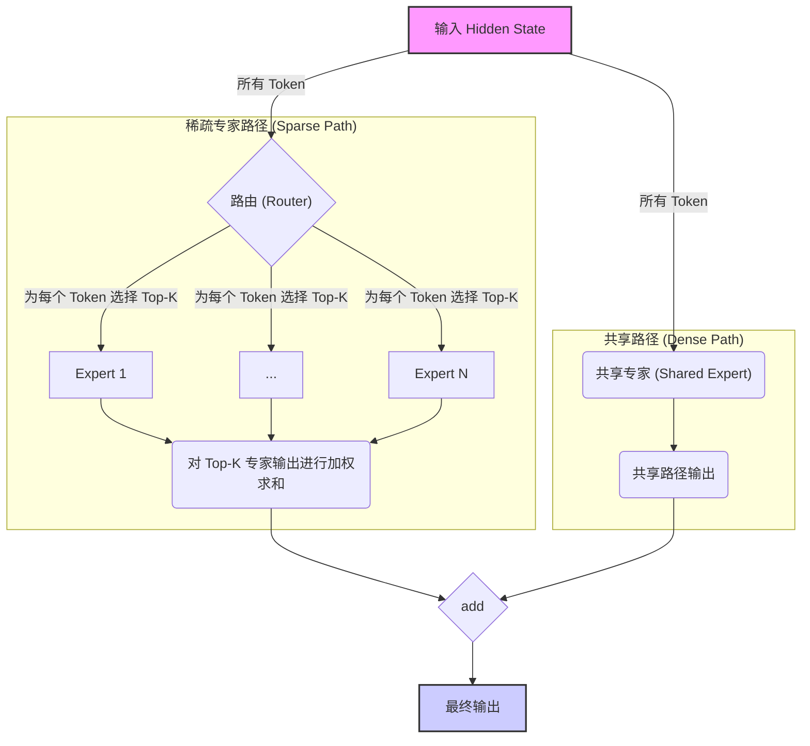
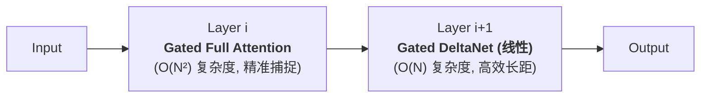

`transformers` 库近期合并了 `Qwen3-Next` 的 [PR](https://github.com/huggingface/transformers/pull/40771/)，正式将其纳入官方生态。这个 PR 提交了 `Qwen3-Next-80B-A3B-Instruct` 模型的实现，该模型被介绍为下一代基础模型，针对超长上下文和大规模参数效率进行了深度优化。官方的描述为：

> The Qwen3-Next series represents our next-generation foundation models, optimized for extreme context length and large-scale parameter efficiency.

该模型的四大核心亮点为：
*   **高稀疏度 MoE (High-Sparsity MoE)**: 实现了极低的计算激活比，在保持庞大知识容量的同时，追求极致的推理性能。
*   **混合注意力 (Hybrid Attention)**: 融合**门控增量网络 (Gated DeltaNet)** 与**门控注意力 (Gated Attention)**，高效建模不同距离的上下文依赖。
*   **多词元预测 (MTP)**: 提升模型性能并为推理加速设计的先进预训练目标。
*   **其他优化**: 包括**零中心化的 RMSNorm** 等，旨在增强训练稳定性。

下面我们来深入 PR 内容，逐一解析 Qwen3-Next 的架构创新。

## 一、高稀疏度 MoE 与共享专家

Qwen3-Next 的混合专家（MoE）设计有两个关键点：高稀疏度和共享专家。

**1. 高稀疏度对解码性能的提升**

高稀疏度是 Qwen3-Next 实现极致性能的核心。以 80B 版本为例，它拥有 800 亿总参数，但在生成每一个 token 时，仅需激活其中的 30 亿参数进行计算。这一激活比远低于当前主流 MoE 模型，是一项关键的架构选择。

这并非简单的“节约”，而是对性能的直接赋能。在自回归生成（decode）任务中，模型需要逐词进行前向传播，此时**每一步的计算量 (FLOPs) 直接决定了生成速度**。通过将激活参数降低一个数量级，Qwen3-Next 实现了：
*   **更高的吞吐量**：在处理长上下文（>32K tokens）时，其推理吞吐量可达 Qwen3-32B 的 **10 倍以上**。
*   **更快的响应速度**：对于用户而言，这意味着更低的延迟和更流畅的交互体验。

可以说，高稀疏度 MoE 是 Qwen3-Next 在解码性能提升上的核心引擎。

**2. 共享专家增强稳定性**

为确保极致稀疏下的稳定性，Qwen3-Next 在 MoE 模块中额外增加了一个**共享专家（Shared Expert）**，形成了一种更稳健的“双轨”设计。


如上图所示，输入 Token 会兵分两路：一路通过路由器选择 Top-K 个稀疏专家进行**专业化**计算；另一路则全部通过一个共享专家进行**通用化**计算。这种设计好比一个会诊流程：共享专家如同经验丰富的“全科医生”，处理基础和通用的语言模式；稀疏专家则像“专科医生”，处理更细分、更专业的知识。`Qwen3NextSparseMoeBlock` 的代码清晰地实现了这一并行结构，共享专家的存在为模型提供了一个稳定的计算基座，极大地提升了模型的鲁棒性。

## 二、混合注意力与 GatedDeltaNet 详解

Qwen3-Next 采用混合注意力架构以高效处理长上下文。它在不同层交替使用 O(N²) 复杂度的标准注意力和 O(N) 复杂度的线性注意力，实现了能力与效率的平衡。



**GatedDeltaNet 计算机制详解**

其中，`Qwen3NextGatedDeltaNet` 是实现线性注意力的核心模块。它通过一套精密的“输入-卷积-门控-递归-输出”流程，在保持线性复杂度的同时，实现了对长距离依赖的有效建模。

1.  **输入映射**: 输入 `hidden_states` 被线性层 (`in_proj_qkvz`, `in_proj_ba`) 投影成一系列中间状态：`query`, `key`, `value` 及用于门控的 `z`, `b`, `a`。

2.  **因果卷积 (局部信息)**: 拼接后的 `qkv` 张量经过一个一维因果卷积，它像一个滑动窗口，用于高效捕捉每个 Token 与其附近邻居之间的局部上下文。
    ```python
    # 文件: modeling_qwen3_next.py -> class Qwen3NextGatedDeltaNet
    mixed_qkv = self.causal_conv1d_fn(
        x=mixed_qkv,
        weight=self.conv1d.weight.squeeze(1),
        # ...
    )
    ```

3.  **门控信号生成**: 模型从投影 `a` 和 `b` 中，学习两个关键的、类似 RNN 的门控信号：
    *   `beta` (输入门): 通过 `sigmoid` 函数，控制有多少新信息（`value`）可以被写入“状态”。
    *   `g` (遗忘门): 控制历史信息的衰减率，决定“记忆”能保留多久。
    ```python
    beta = b.sigmoid()
    g = -self.A_log.float().exp() * F.softplus(a.float() + self.dt_bias)
    ```

4.  **门控增量规则 (全局信息)**: 将 `q, k, v` 和门控信号 `beta, g` 送入核心的递归函数，进行全局信息传递。这一步是实现 O(N) 复杂度的关键。
    ```python
    core_attn_out, _ = self.chunk_gated_delta_rule(
        query, key, value, g=g, beta=beta, ...
    )
    ```

5.  **输出门控**: `GatedDeltaNet` 的输出 `core_attn_out` 还会被 `z` 进行最终的门控调制，然后才传递给下一层。
    ```python
    core_attn_out = self.norm(core_attn_out, z)
    ```
通过这套流程，`GatedDeltaNet` 实现了“卷积捕捉局部，递归传递全局”的高效信息处理模式。

## 三、多词元预测 (MTP)

多词元预测 (MTP) 是一种先进的预训练目标，它在预训练和推理阶段都有显著增益。

*   **预训练阶段**: 传统模型在 `t` 时刻只预测 `t+1` 的词元。MTP 则要求模型在 `t` 时刻同时预测 `t+1`, `t+2`, ..., `t+n` 多个未来的词元。这有助于模型学习更具前瞻性的语言模式，提升了其对因果关系的理解。
*   **推理阶段**: MTP 的能力天然适配**思辨解码 (Speculative Decoding)**。模型可以一次性生成 `n` 个候选 token，再由系统并行验证，从而在命中率高的情况下，数倍提升解码速度，是实现高效推理的关键技术之一。

`Qwen3NextPreTTrainedModel` 类中的 `_keys_to_ignore_on_load_unexpected = [r"^mtp.*"]` 这行代码，证实了 MTP 是其预训练阶段的一部分，相关的权重已经融入模型，即使推理代码中没有显式的多头预测结构。

## 四、其他架构优化：零中心化 RMSNorm

Qwen3-Next 对 RMSNorm 进行了精巧的改进，以增强训练稳定性。

```python
# 文件: modeling_qwen3_next.py -> class Qwen3NextRMSNorm
def forward(self, x):
    # 核心: 乘以 (1.0 + weight)，而非直接乘 weight
    output = self._norm(x.float()) * (1.0 + self.weight.float())
    return output.type_as(x)
```
由于 `self.weight` 初始化为 0，该层在训练初期近似于一个无参数的纯归一化操作。这个看似微小的改动有助于稳定梯度在网络深层的传播，特别是在训练初期，对避免梯度爆炸或消失问题有积极作用。

## 总结

`Qwen3-Next` 的设计哲学是在“大而全”和“小而美”之间寻找最佳平衡点。它并非依赖单一技术的颠覆，而是通过一系列精心设计的技术组合：
*   **高稀疏度 MoE 与共享专家**，平衡了计算负载与模型鲁棒性。
*   **混合注意力与 GatedDeltaNet**，平衡了对不同距离上下文的建模能力与计算效率。
*   **MTP**，同时优化了模型的预训练效果与推理速度。
*   **零中心化 RMSNorm** 等细节，提升了训练的稳定性。

这些技术细节的深度融合，最终造就了这款在性能、效率和训练成本上都极具竞争力的下一代大语言模型。