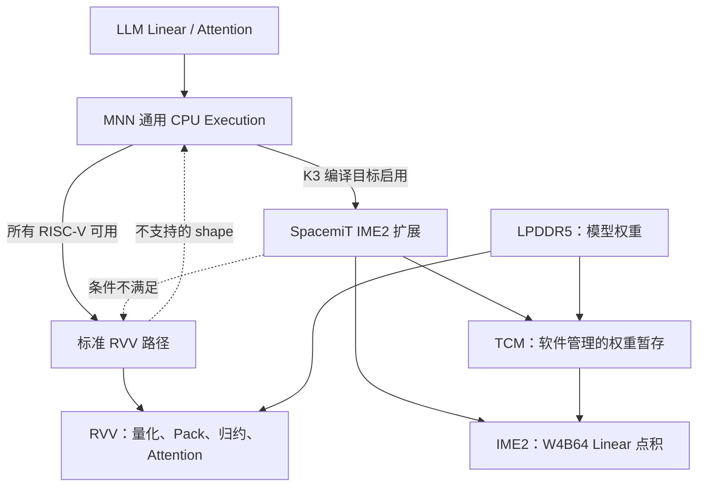
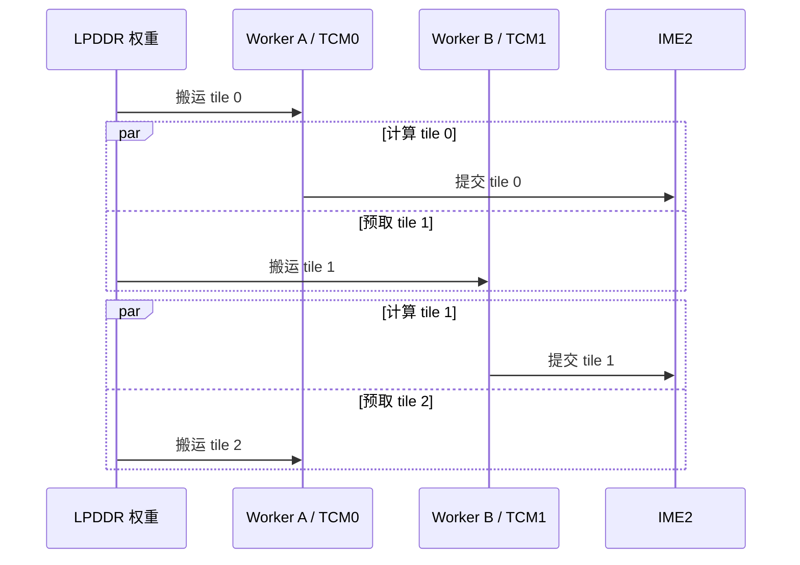

最近我们在进迭时空 K3 上对 MNN 的 LLM 推理做了一轮优化，针对 HQQ block64 非对称 W4 模型，利用标准 RVV、IME2 矩阵扩展和 TCM，分别优化了 Linear/MatMul 的 prefill 和 decode 性能，同时也调整了 Attention、KV Cache 以及 K3 专用后端的代码组织。下面记录具体的实现过程和测试结果，相关代码见 [MNN PR #4702](https://github.com/alibaba/MNN/pull/4702)。

## 一、测试结果

最终测试使用 MNN `llm_bench`，模型权重为 HQQ block64 非对称 W4，激活在运行时动态量化为 INT8，使用 8 个线程。`pp512` 表示输入 512 个 token 的 prefill 吞吐，`tg128` 表示实际生成 128 个 token 的 decode 吞吐。每项数据来自 3 个独立进程，每个进程重复 5 次后取均值，模型加载时间不计入测试。

| 模型 | pp512 | tg128 |
|---|---:|---:|
| Qwen3-0.6B | 381.24 tok/s | 54.49 tok/s |
| Qwen3-1.7B | 169.29 tok/s | 24.90 tok/s |
| Qwen3.5-0.8B | 127.57 tok/s | 33.85 tok/s |
| Qwen3.5-2B | 85.60 tok/s | 17.68 tok/s |

Qwen3.5 采用线性 Attention 与全 Attention 混合架构，这里测试的是文本主干。不同模型架构、隐藏维度和 Attention 比例不同，因此横向数值并不代表模型之间的优劣；这组数据主要用于检查同一套 K3 优化能否覆盖多种尺寸和结构，避免只对固定 shape 特化。

开发早期我们曾用 `pp128` 作为快速迭代指标，打通 IME2 Linear 并融合动态量化与 A Pack 后，第一阶段获得了约 18% 的提升。由于当时的量化和测试长度与最终公开口径不同，绝对值不放进最终结果表；这也提醒我们，性能优化开始前必须先固定量化格式、输入长度和统计方式。此后的工作则从“提高矩阵计算速度”逐渐转向“减少每个 token 必须搬运和整理的数据”。

## 二、K3 上的 RVV、IME2 和 TCM

K3 包含 8 个 X100 通用 CPU 核和 8 个 A100 AI CPU 核。A100 运行 RISC-V/Linux，既支持标准 RVV 1.0，也提供进迭自研的 IME（Intelligence Matrix Extension）矩阵扩展；每两个参与计算的 A100 核共享一套 IME2 和局部存储资源。可以把 RVV 与 IME2 理解为两层能力：

- RVV 是通用向量计算基础，适合数据重排、量化、逐元素计算、归约和普通向量 FMA。
- IME2 面向矩阵乘加，提供整数、浮点、稀疏和 block-scale 等点积指令，并支持配套的 pack/unpack 操作。

IME2 采用 1024-bit 的架构寄存器/矩阵 tile 接口，但这不代表所有普通 RVV 指令都能以 1024 bit/cycle 执行。公开指令可大致分为以下几类：

| 指令族 | 主要能力 | 在本次优化中的位置 |
|---|---|---|
| `smt.vmadot*` | INT4/INT8 矩阵点积 | W4B64 Linear 主计算 |
| `smt.vmadot.sp*` | 4:2 稀疏点积 | 本次密集 W4 未使用 |
| `smt.vmadot.hp*` | block-scale 点积 | 减少缩放相关指令 |
| `smt.vfwmadot*` | FP16/BF16 累加到 FP32 | 浮点矩阵计算能力 |
| pack/unpack | 半字节拆分与布局整理 | INT8×INT4 映射和数据准备 |

公开资料给出的 K3 芯片峰值为：密集 INT4 约 30 TOPS、稀疏 INT4 约 60 TOPS，INT8 分别约 15/30 TOPS，FP16/BF16 约 7.5 TOPS。这里必须注意，我们优化的 W4B64 是密集非对称量化，不能直接用“60 TOPS 稀疏 INT4”来估算上限。

另一个关键资源是 TCM。K3 的 A100 部分共有 2 MiB L2 和 3 MiB TCM，外部内存接口的理论带宽最高约 51 GB/s。L2 是硬件管理的缓存，而 TCM 是软件显式管理的片上 scratchpad：它不会自动把热点权重留在片上，使用者需要决定搬什么、何时搬、由哪个 worker 使用，以及资源不足时如何回退。

这也形成了我们最终采用的软件分层：通用 CPU 实现负责正确性，标准 RVV 实现覆盖普通 RISC-V，K3 扩展只承载 IME2 和 TCM 特有逻辑。每一层都有明确的回退路径。

## 三、非对称 W4B64 的计算展开

HQQ block64 非对称 W4 的权重可近似表示为：

$$w \approx s_w(q_w-z_w)$$

因此一行 Linear 在计算量化点积之外，还要处理 zero point 修正：

$$\sum a_i w_i \approx s_w\left(\sum a_iq_i-z_w\sum a_i\right)$$

这意味着 Kernel 除了主点积，还需要输入行和 `srcKernelSum`。如果先量化 A、再单独扫描求和、然后重新打包，内存会被反复读取，IME2 即使算得再快，也会被前后处理抵消。

IME2 的基础整数矩阵指令使用同位宽输入。MNN 把 INT8 激活拆成高、低两个半字节，通过两次 INT4 点积组合出 INT8×INT4 结果：

$$a_8 = 16\times(a_8\mathbin{\gg}4)+(a_8\mathbin{\&}0x0f)$$

其中高半字节按有符号数处理，低半字节按无符号数处理。block-scale `.hp` 指令可以减少缩放相关指令；zero point、行和与残差仍由软件完成融合。

基于这个数学语义，我们为非对称 W4B64 分别设计了 prefill 的 M4 Kernel 和 decode 的 M1 asym-pair Kernel，各自适配不同的矩阵形状和数据流。

## 四、Prefill：把量化、Pack 和 Epilogue 融进数据流

Prefill 一次处理多个 token，矩阵的 M 维较大，更容易利用计算单元，但数据准备开销也会被放大。旧路径大致是：

1. 扫描输入求 `absmax`，生成动态量化 scale。
2. 再次读取输入，完成 INT8 量化和 A Pack。
3. 执行 GEMM，写入临时输出。
4. 做 scale、zero point 修正、bias/clamp，再转换为 MNN 的 C4 布局。

我们的第一步是把前两次扫描合并：A Pack 阶段直接完成 `absmax → quantScale/inputScale → packedA + srcKernelSum`。这样既少了一次完整输入遍历，也减少了一次 worker dispatch。

第二步是按 M4 粒度重组任务。每个任务连续处理 4 行，复用相同的 B tile，减少小任务调度和重复地址计算，使 IME2 的矩阵形状与 prefill 的工作负载更匹配。

第三步是 direct-C4 epilogue：GEMM 累加完成后，直接执行缩放、非对称修正、bias/clamp，并写入最终 C4 输出，跳过中间 C 缓冲区和后续布局转换。

这三项优化都在减少数据在 Kernel 之间落地，汇编指令数量只是其中一部分。对于端侧推理，少写一次大矩阵通常和多做几条算术指令同样重要。

## 五、Decode：计算很小，搬运才是主角

Decode 每次只生成一个 token，Linear 的 M=1。此时大部分模型权重都要为每个 token 重新读取一次，问题迅速从算力受限变成带宽受限：

$$\text{tokens/s}\approx\frac{\text{sustained memory bandwidth}}{\text{weight bytes + metadata bytes per token}}$$

因此 decode 的优化重点和 prefill 完全不同。

### 1. M1 分层 Pack 与直接输出

我们按 K256 super-block 组织 M1 的 A Pack，让量化、重排和 Kernel 消费顺序保持一致。满足无额外 bias、clamp、residual、input-scale 等严格条件时，M1 Kernel 还可以把 FP32 结果直接写到最终输出，省掉临时 C 和独立 post pass；条件不满足则回退到原实现。

在 Qwen3-1.7B 的一次独立 A/B 测试中，仅 direct-output 就把 `tg128` 从约 22.42 tok/s 提升到 22.61 tok/s。收益不大，却说明 decode 的每一次内存落地都值得检查。

### 2. TCM worker-pair copy-compute 流水

更大的收益来自 TCM。实现中把 worker 按 pair 组织，避免所有线程同时争抢片上空间；每个软件 worker 持有自己的逻辑缓冲区，一边计算当前 tile，另一边预取下一个 tile，随后交换角色。

这里的 worker 是软件所有权，不代表每个 worker 独占一块物理 TCM；底层 bank 仍由成对核心共享。当前实现通过 RVV load/store 完成拷贝，还没有使用 AI-DMA，因此流水线主要是在软件层重叠搬运与计算。

TCM 路径只在非对称 W4B64、M1 asym-pair、K≥2048、packed-B≥2 MiB、至少存在两个真实 TCM block 等条件下启用。运行时还会检查容量与可用性，任一条件不满足便回退到 DRAM 路径。这样做的原因很现实：小矩阵的拷贝与同步成本可能比节省的访存还大。

在 Qwen3-1.7B 的配对测试中，TCM 流水把 `tg128` 从约 22.51 tok/s 提升到 24.91 tok/s，提升约 10.7%。我们也试过把计算 worker 从 6 个增加到 8 个，结果反而从 22.30～22.37 tok/s 降到 21.95～21.99 tok/s。更多线程加剧了带宽竞争和同步开销，最终保留 6 个计算 worker。

这次实验给出的结论很清楚：decode 优化不能只看核心占用率。在线程已经把内存通道压满之后，再增加并发只会让大家更忙，却不会让 token 更快地产生。

## 六、Attention 与 KV Cache 的 RVV 快速路径

Linear 是 IME2 的主战场，但完整 LLM 还有 Attention 和 KV Cache。这里我们刻意没有强行套用矩阵扩展。

Decode Attention 的 QK 和 PV 更接近短向量 matvec，标准 RVV 的 FP16/FP32 FMA、归约和类型转换更合适。K3 快速路径采用类似 FlashAttention 的分块在线 softmax 思路，把 QK、online softmax 和 PV 合并，并使用每个 worker 的 TCM scratch，避免完整 attention score 矩阵落地。这条 fused Attention 路径使用 RVV 完成核心计算，IME2 `vmadot` 主要用于 Linear。

KV Cache 侧则优化连续 FP32 key/value 的循环与地址计算，并在验证收益和正确性后并行更新；量化或非连续布局继续走通用逻辑。最终回退链是：

`K3 fused Attention → 标准 RVV Attention → 通用 CPU Attention`

专用硬件只接管已经验证过的形状，其余场景继续使用 RVV 或通用 CPU 回退，从而保留完整的适用范围。

## 七、从功能分支到可维护的后端扩展

性能优化的前半程，我们曾直接在通用 `CPUAttention` 和 `ConvInt8TiledExecutor` 中加入 RISC-V 判断。功能可以工作，但会让占绝大多数使用量的 ARM/x86 CPU 路径背上不相关的分支、成员和格式改动，也让专用布局知识泄漏进基类。

最终代码重构为三层：

- 通用 CPU 基类只保留稳定、很窄的扩展点。
- 标准 RVV 子类实现普通 RISC-V 的向量快速路径。
- K3 子类实现 IME2 Linear、专用权重重排和 fused Attention。

构建时通过 `MNN_RVV_SPACEMIT_IME2` 决定是否编译 K3 扩展；宏关闭时，vendor 指令和快速路径不会进入二进制。运行时只保留 shape、量化格式、线程数和 TCM 资源等必要门禁，不再通过环境变量组合大量实验开关。

这次重构还有一个实践经验：基类不应该替子类猜测 IME2 的 layout。通用重排器只把 shape 与布局信息交给回调，是否支持、怎样处理由 K3 子类判断。这样既保住了已有调度和内存生命周期，又避免为了一个芯片复制整套 CPU Execution。

## 八、开发方式与验证

这次优化的大部分代码由 Codex + GPT-5.6 Sol 完成。AI 在本地工作区阅读和修改代码，再通过 SSH 到远端 K3 开发板编译和测试。人主要提出优化方向、确定量化与测试口径并审核结果；AI 负责具体实现、运行远端实验、做 A/B 对比，再根据结果继续迭代。

每项改动都会在 K3 上检查 IME2 和纯 RVV 两种构建，覆盖定向算子测试、短生成、TCM 与 DRAM 对拍以及多个模型的 prefill/decode benchmark，性能数据采用多个独立进程统计。实验中也淘汰了几项负收益方案：早期 fused Linear 实测变慢，8 个 worker 慢于 6 个，无条件启用 TCM 会拖累小 shape；当前 TCM 搬运仍使用 RVV load/store，AI-DMA 留作后续优化。

## 九、一些经验

1. 先写清量化公式和数据布局，再选指令。IME2 很强，但非对称 W4B64 的 zero point、行和、scale 和输出布局仍需要软件设计。
2. Prefill 与 decode 应分别建模。前者倾向计算利用率，后者通常先撞上内存带宽。
3. 融合主要用于减少读写和调度，函数数量只是实现形式。
4. TCM 是需要显式编排的 scratchpad，使用方式与自动管理的 cache 不同。
5. 线程数需要根据带宽和共享计算资源选择，decode 尤其明显。
6. Vendor 优化要有编译期隔离、运行时门禁和完整回退，不能让极少数硬件路径污染通用 CPU 后端。

后续还可以继续尝试 AI-DMA，让权重搬运和计算更充分地重叠；也可以根据 shape 和线程数动态选择 TCM tile，并继续优化长上下文下的 Attention 和 KV Cache。当前实现中的一些固定门槛，也需要积累更多模型和 shape 数据后再逐步调整。

回头看，这次没有某一个 Kernel 决定全部结果。Prefill 的主要收益来自量化、Pack 和输出阶段的合并，decode 更依赖权重流量、TCM 和线程配合，Attention 又是另一套 RVV 分块计算。把这些环节分别测清楚，再接回一条完整的数据流，比单独追求某条指令的峰值更有用。

## 参考资料

- [MNN：轻量级深度学习推理引擎](https://github.com/alibaba/MNN)
- [进迭时空 K3 产品简介](https://cdn-resource.spacemit.com/file/chip/K3/K3_brief_zh.pdf)
- [SpacemiT A100：AI CPU with Matrix and Vector Extensions](https://forum.spacemit.com/uploads/short-url/60aJ8cYNmrFWqHn4ddwwSzMLjlY.pdf)
- [SpacemiT IME Extension Documentation](https://github.com/spacemit-com/docs-ai/blob/main/en/architecture/ime_extension.md)
- [SpacemiT Architecture Concepts](https://github.com/spacemit-com/docs-ai/blob/main/en/architecture/concept.md)
